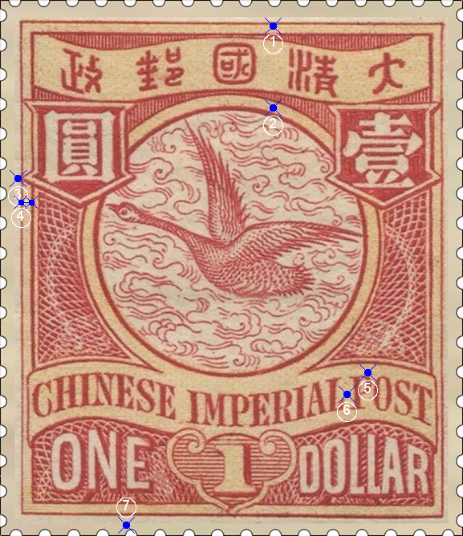
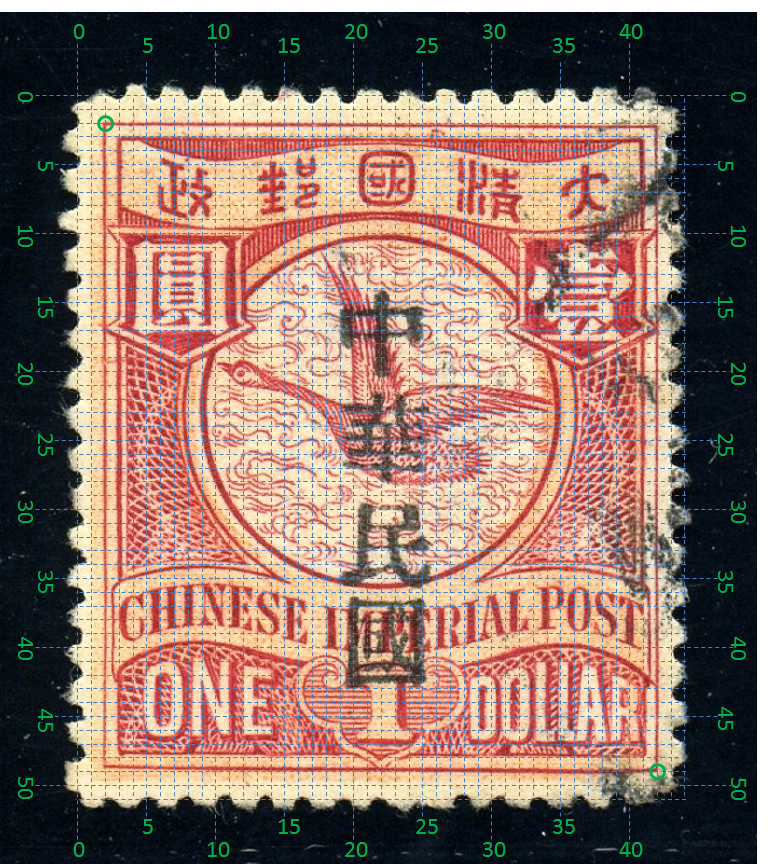
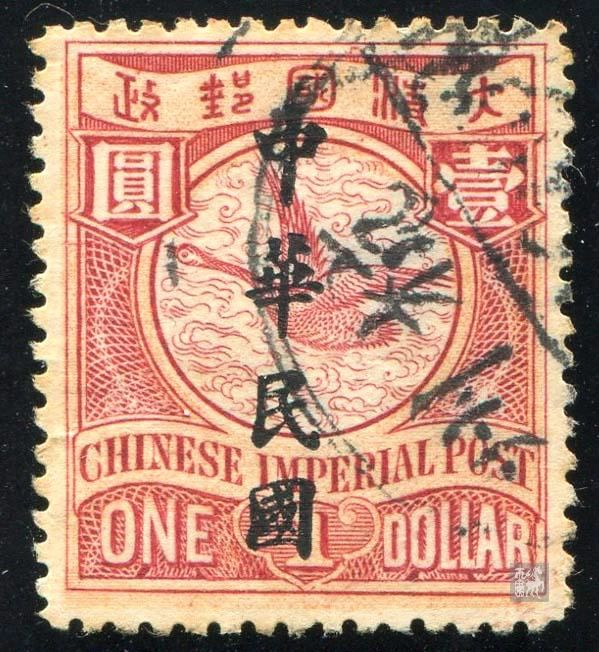

# 大清飞雁壹圆邮票印刷缺陷 (#5)

## 模型
 

## 缺陷列表
1. (13.0mm, 1.25mm) :  清字左上方内外边框之间有4个小点。
1. (13.0mm, 5.12mm) :  圆环上方偏右有两个小点。
1. (0.88mm, 8.5mm) :  圓字左侧外框线上有小点。
1. (1.0mm, 9.63mm) - (1.5mm, 9.63mm) :  圓字左下侧内外框之间有短横线。
1. (17.5mm, 17.75mm) :  国铭字母P右上方有小点。
1. (16.5mm, 18.75mm) :  国铭字母L与P之间有小点。
1. (6.0mm, 25.0mm) :  面值字母E下方外边框下有小点。

## 实例

## 描述
[REPLACE_DESCRIPTION]
