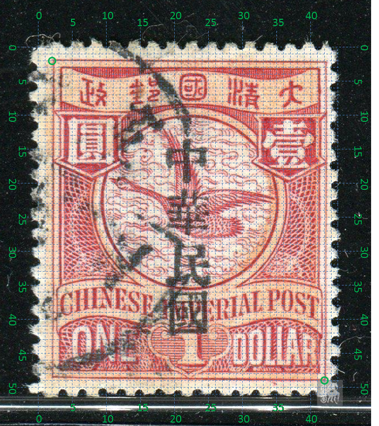

# 大清飞雁壹圆邮票印刷缺陷 (#6)

## 模型
 

## 缺陷列表
1. (17.75mm, 8.75mm) :  壹字下横左起1/3处有小点。
1. (15.63mm, 16.25mm) :  圆环右下方内边线外侧有小点。
1. (13.5mm, 18.0mm) :  国铭字母R正上方有小点。
1. (14.0mm, 18.0mm) :  国铭字母R右上方有小点。
1. (18.88mm, 21.5mm) :  面值字母A中上偏右有小点。
1. (18.38mm, 22.0mm) :  面值字母A中部左侧有小点。
1. (17.5mm, 25.0mm) :  面值字母两L之间下方外边框下有短斜线。

## 实例

## 描述
[REPLACE_DESCRIPTION]
