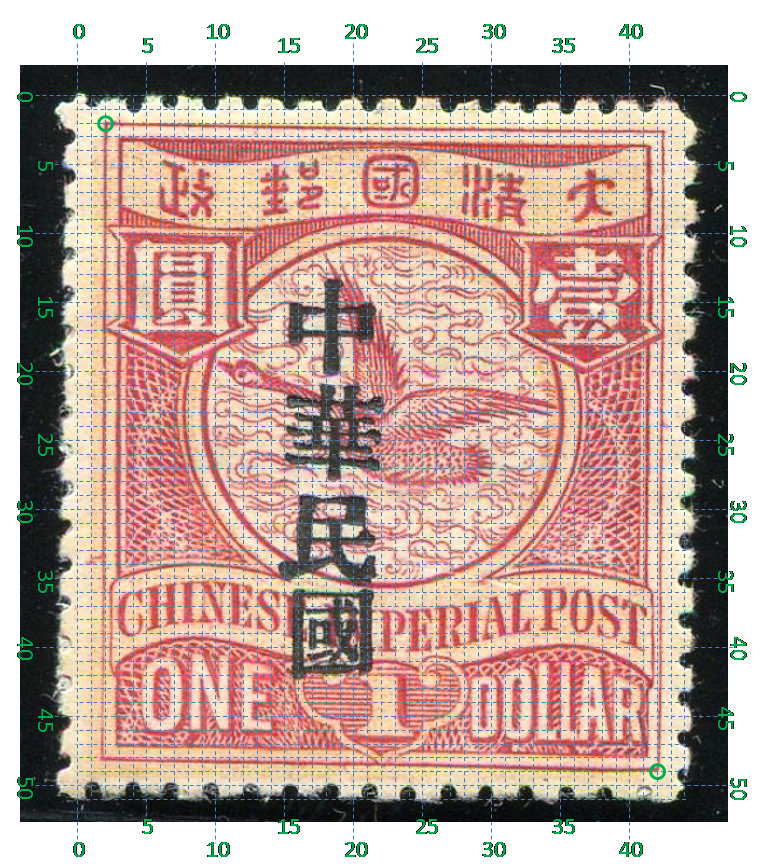

# 大清飞雁壹圆邮票印刷缺陷 (#8)

## 模型
 

## 缺陷列表
1. (4.0mm, 2.38mm) :  政字正上方有小点。
1. (12.0mm, 4.63mm) :  圆环正上方偏右靠近外边界处有小点。
1. (21.13mm, 12.0mm) :  右花纹右侧外边框线上有小点。
1. (16.0mm, 16.5mm) :  圆环右下方外边界内侧有小点。
1. (0.5mm, 17.0mm) - (1.0mm, 16.5mm) :  左花纹左侧外边框外侧有短线。

## 实例
      

## 描述
[REPLACE_DESCRIPTION]
