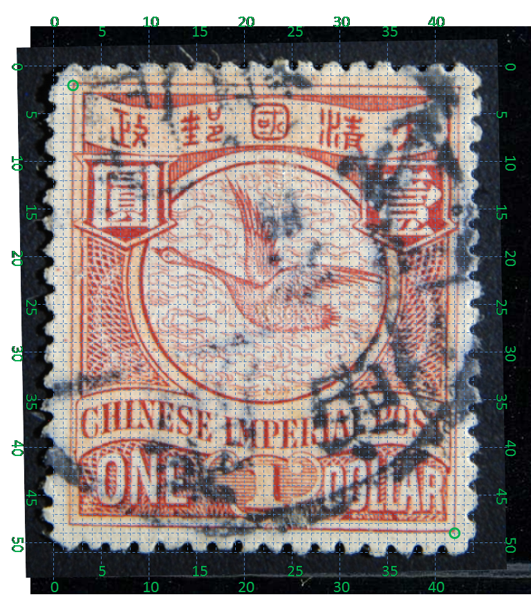
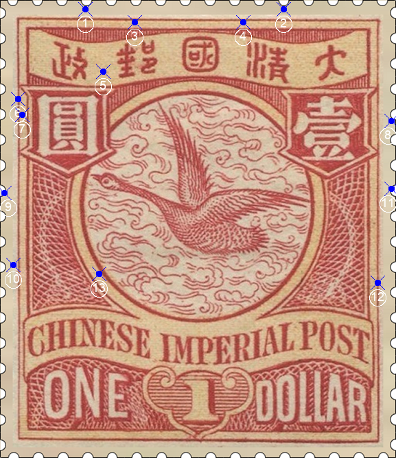
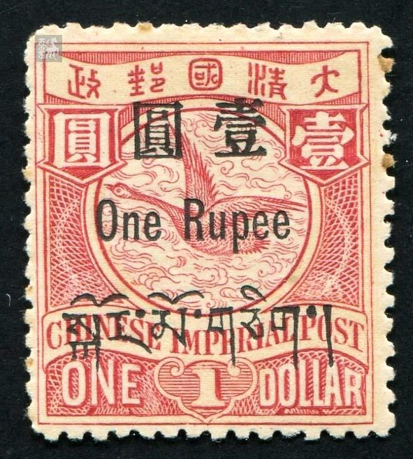

# 大清飞雁壹圆邮票印刷缺陷 (#11)

## 样本与模型
 

## 缺陷列表
1. (4.75mm, 0.5mm) :  政之“攴”部上方外边框外侧有小点。
1. (15.75mm, 0.5mm) :  清之“青”部上方外边框外侧有小点。
1. (7.5mm, 1.25mm) :  邮字上方内外边框之间有小点。
1. (13.5mm, 1.25mm) :  清字左上方内外边框之间有斜点。
1. (5.75mm, 4.0mm) :  邮与政之间中下方有小点。
1. (1.0mm, 5.5mm) :  圆字左侧外边框线上有小点。
1. (1.25mm, 6.38mm) :  圆字左侧内外边框线之间有上下排列的两条淡淡的短斜线。推测此缺陷在前期可能表现为两个小点，后来先后深化为斜线。在下图1实例中，下面一条斜线已经形成，但上面仍然是点。
1. (21.75mm, 6.75mm) :  圆字右侧外边框线外侧有小点。
1. (0.25mm, 10.75mm) :  左花纹左侧外边框线外靠中上位置有小点。
1. (0.75mm, 14.75mm) :  左花纹左侧外边框线外靠中下位置有小点。
1. (21.75mm, 10.5mm) :  右花纹右侧外边框线外靠中上位置有小点。
1. (21.0mm, 15.75mm) :  右花纹右侧外边框线上靠中下位置有小点。
1. (5.5mm, 15.25mm) :  圆环左下方内外边界线之间有小点。

## 实例
     

## 描述
[REPLACE_DESCRIPTION]
