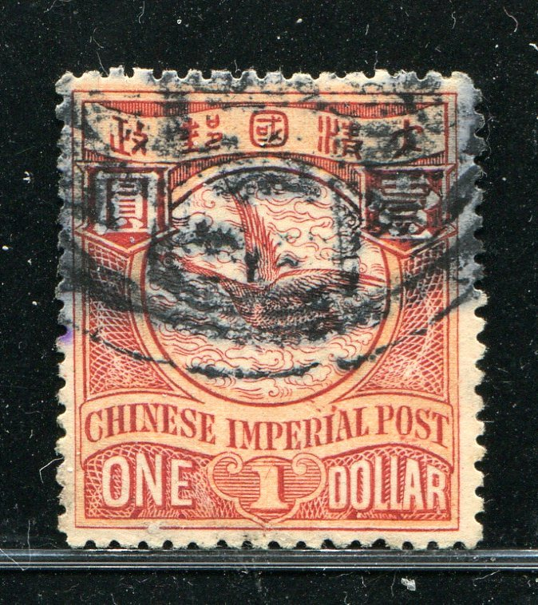

# 大清飞雁壹圆邮票印刷缺陷 (#12)

## 模型
[REPLACE_MODEL]

## 缺陷列表
1. (13.5mm, 17.5mm) :  国铭R字母上方圆环内边界线外侧有斜点。
1. (14.5mm, 17.25mm) :  国铭IMPERIAL第6字母I上方圆环内外边界线之间有小点。
1. (13.5mm, 18.0mm) :  国铭R字母右上方有小点。
1. (14.5mm, 18.0mm) :  国铭IMPERIAL第6字母I右上方有紧邻的上下排列两个小点。
1. (18.0mm, 19.75mm) :  国铭字母O下方有模糊点。
1. (18.75mm, 19.75mm) :  国铭POST字母S左下方有模糊点。
1. (19.5mm, 18.0mm) :  国铭POST字母S右上方有模糊点。
1. (20.38mm, 17.5mm) :  国铭字母T右上方的夹角内有小点。
1. (20.5mm, 18.5mm) :  国铭字母T右上角有小点。
1. (11.0mm, 22.0mm) - (11.25mm, 21.25mm) :  面值数字1内靠上方有反斜线。

## 实例

## 描述
[REPLACE_DESCRIPTION]
