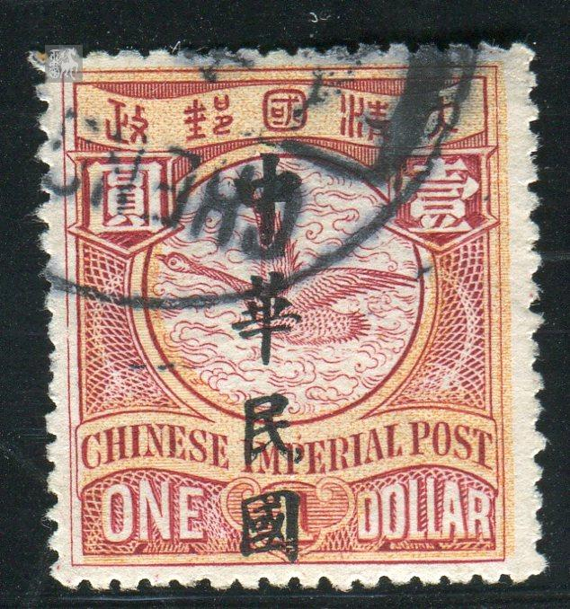

# 大清飞雁壹圆邮票印刷缺陷 (#13)

## 模型
[REPLACE_MODEL]

## 缺陷列表
1. (11.5mm, 18.5mm) :  国铭IMPERIAL字母P上方有斜点。
1. (1.0mm, 22.5mm) :  面值ONE左侧外边框线上有小点。
1. (0.5mm, 24.5mm) :  外边框线左下角外侧有小点。
1. (5.0mm, 25.0mm) :  面值ONE字母N下方外边框线下方有小点。

## 实例
      

## 描述
[REPLACE_DESCRIPTION]
