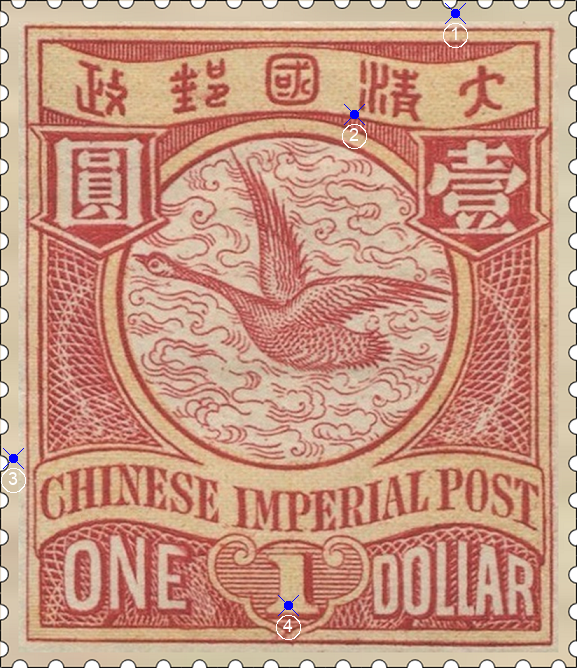
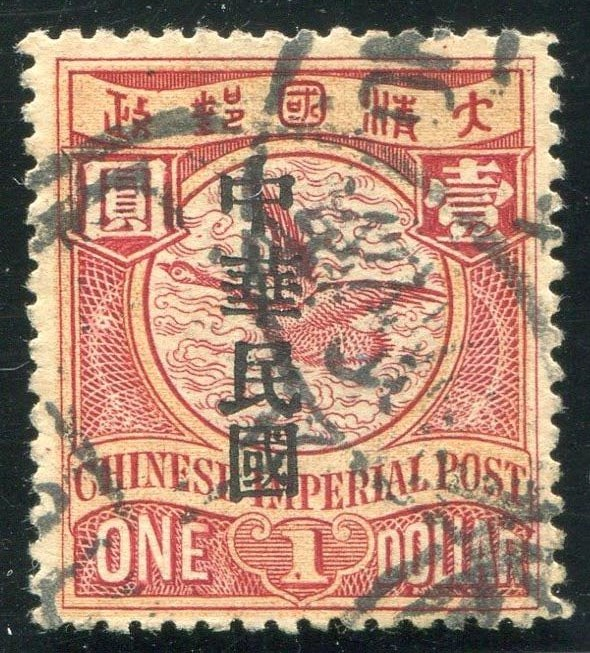

# 大清飞雁壹圆邮票印刷缺陷 (#15)

## 样本与模型
 

## 缺陷列表
1. (17.38mm, 0.5mm) :  大字左上方外边框线上方有小点。
1. (13.5mm, 4.38mm) :  清字左下方有小点。
1. (0.5mm, 17.5mm) :  英文国铭字带左上方外边框线外侧有小点。
1. (11.0mm, 23.13mm) :  面值1字内部下方有点。

## 实例
   

## 描述
[REPLACE_DESCRIPTION]
