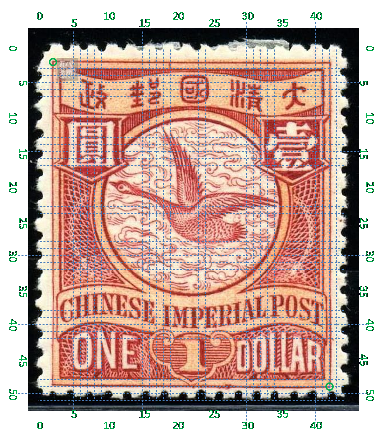

# 大清飞雁壹圆邮票印刷缺陷 (#17)

## 模型
 

## 缺陷列表
1. (1.75mm, 2.5mm) :  政字左边内边框内侧有横向长点。
1. (5.0mm, 3.87mm) :  政字右边有小点。
1. (20.75mm, 2.25mm) :  国与政字中间内外边框间有斜长点。
1. (9.25mm, 1.25mm) :  汉字国铭字带右侧，内外边框间有横向长点。
1. (21.13mm, 4.0mm) :  汉字国铭字带右侧，外边框外侧有小点。
1. (21.38mm, 5.38mm) :  壹字右上方外边框外侧有小点。
1. (2.0mm, 19.25mm) :  国铭C字母中间有小点。
1. (8.5mm, 20.0mm) :  国铭CHINESE最后一个字母E右下角有小点。
1. (16.5mm, 19.63mm) :  国铭L和P字母间下方有小点。
1. (21.13mm, 21.0mm) :  国铭右侧外边框线外侧有小点。
1. (13.5mm, 24.5mm) :  如意右下方外边框线上有模糊的大点。

## 实例
         

## 描述
[REPLACE_DESCRIPTION]
