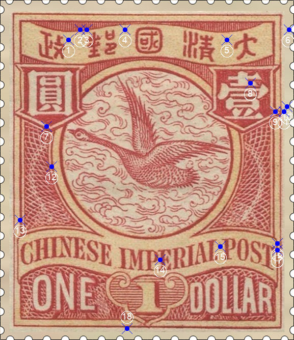
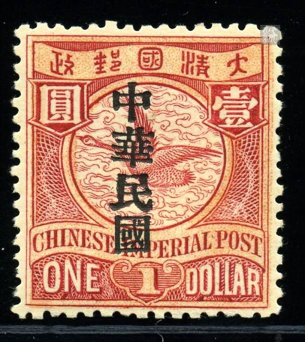

# 大清飞雁壹圆邮票印刷缺陷 (#18)

## 样本与模型
 

## 缺陷列表
1. (5.13mm, 3.0mm) :  政字右边偏上位置有小点。
1. (6.0mm, 2.25mm) :  邮字左上方，国铭字带上边缘线上有小点。
1. (6.5mm, 2.25mm) :  邮字左上方，国铭字带上边缘线上有小点。
1. (9.38mm, 2.25mm) :  国与邮字中间靠上位置有小点。
1. (17.0mm, 3.0mm) :  大与清字中间靠上位置有小点。
1. (21.63mm, 2.25mm) :  国铭右侧外边框线外测有小点。
1. (3.5mm, 9.5mm) :  圆字背景框下方尖角偏左位置，内外边界间有小点。
1. (18.75mm, 6.25mm) :  壹字上“士”部下横右半段几乎被截断。在陈兆汉著《中国邮票图鉴》中，把此处印刷特征记录为“B型修饰”。
1. (20.63mm, 8.38mm) :  壹字背景框右下尖角处，内框的下边缘线延伸至外边缘。
1. (21.5mm, 8.0mm) :  壹字右侧，外边框线外侧有小点。
1. (21.25mm, 8.38mm) :  壹字右侧，外边框线外侧有小点（较上点更近）。
1. (3.88mm, 12.5mm) :  左花纹右边线与圆环外边界线之间有小点。
1. (1.5mm, 16.5mm) :  左花纹左侧，内边框线个侧偏下位置有小点。
1. (12.0mm, 19.5mm) :  国铭字母P和E之间有淡淡的小点。
1. (16.5mm, 18.5mm) :  国铭字母L和P之间有正向斜点。
1. (20.75mm, 18.25mm) :  国铭字带右边界线与外边框线之间有小点。
1. (20.75mm, 18.75mm) :  国铭字带右边界线与外边框线之间有小点（较上点下移）。
1. (9.5mm, 24.63mm) :  如意左下方，外边框线上外侧有小点。

## 实例
                   

## 描述
[REPLACE_DESCRIPTION]
