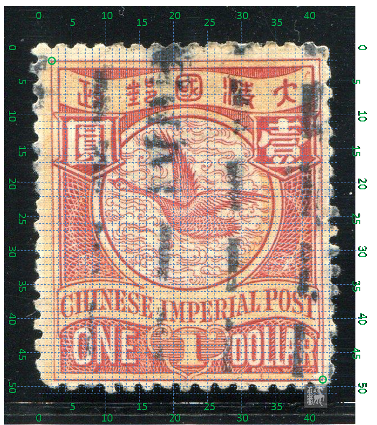
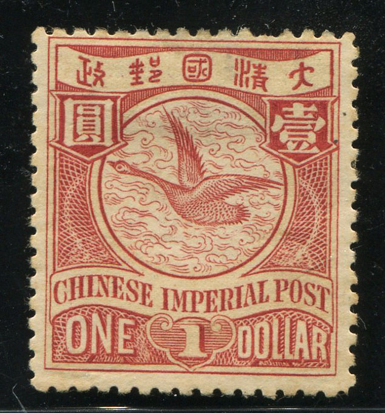

# 大清飞雁壹圆邮票印刷缺陷 (#19)

## 模型
 

## 缺陷列表
1. (20.0mm, 2.25mm) :  汉字国铭字带内部靠近右上角处有反向的长斜点，右上方似分叉。
1. (17.25mm, 3.5mm) :  大字“一”划左边有小点。
1. (7.5mm, 17.5mm) :  英文字带与国环外边界线形成的左边尖角处有反向长点。
1. (2.75mm, 19.75mm) :  国铭字母H左下方有小点。
1. (18.0mm, 19.63mm) :  国铭字母O下方有小点。
1. (20.25mm, 19.0mm) :  国铭字母T右方有小点。
1. (16.5mm, 24.25mm) :  面值DOLLAR的字母O与L之间下方，内外边框线间有模糊的长点（或两个相邻的小点）。

## 实例
         

## 描述
[REPLACE_DESCRIPTION]
