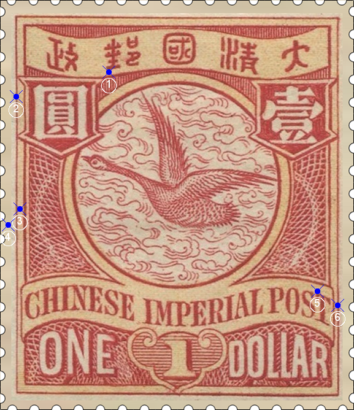
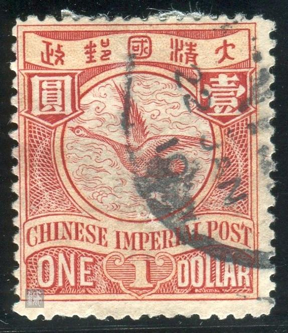

# 大清飞雁壹圆邮票印刷缺陷 (#20)

## 样本与模型
 

## 缺陷列表
1. (6.75mm, 4.5mm) :  邮字“垂”部下横左下角有小点。
1. (1.0mm, 6.0mm) :  圆字左侧，外边框线上内侧有小点。
1. (1.25mm, 13.0mm) :  左花纹左侧内外边框线之间有小点。
1. (0.5mm, 14.0mm) :  左花纹左侧外边框线外有小点。
1. (19.75mm, 18.13mm) :  国铭字母T左上角突出。
1. (21.0mm, 19.0mm) :  国铭字带右侧，外边框线上右侧有小点。

## 实例
       

## 描述
[REPLACE_DESCRIPTION]
