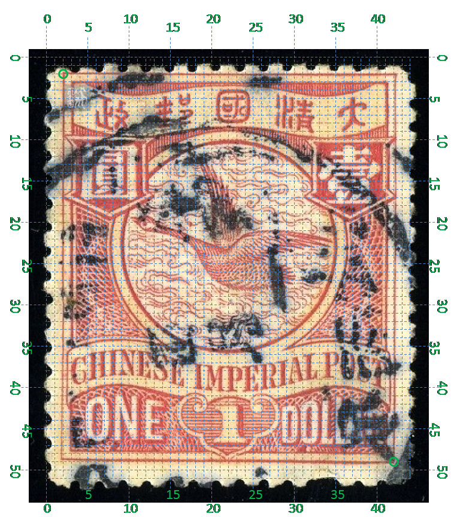

# 大清飞雁壹圆邮票印刷缺陷 (#21)

## 模型
 

## 缺陷列表
1. (3.0mm, 1.38mm) :  政字左上方，内外边框线之间有小点。
1. (10.0mm, 2.0mm) :  国字左上方有小点。
1. (4.0mm, 6.38mm) :  圆字“口”部下横中间有小点。
1. (3.38mm, 8.0mm) - (5.13mm, 8.13mm) :  圆字“八”部被横线贯穿，右侧延伸至右边竖线内止。
1. (15.0mm, 17.88mm) :  国铭字母A上方有小点。
1. (2.5mm, 20.0mm) :  国铭字母C右下方有小点。
1. (14.63mm, 23.25mm) :  国值字母D内下部有正向斜点。

## 实例
  

## 描述
[REPLACE_DESCRIPTION]
