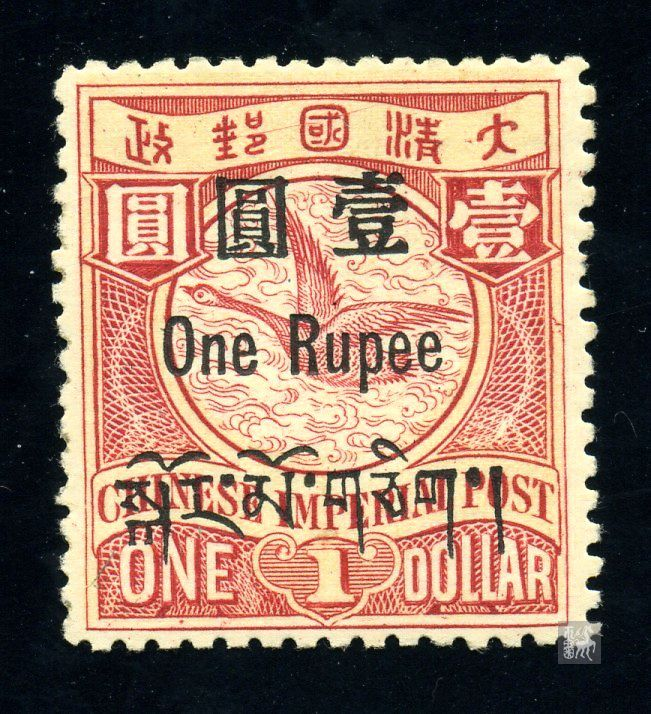

# 大清飞雁壹圆邮票印刷缺陷 (#23)

## 模型
[REPLACE_MODEL]

## 缺陷列表
1. (2.0mm, 3.0mm) :  汉字国铭字带内左边界右侧有小点。
1. (18.5mm, 1.5mm) :  大字上方内外边框线间有小点（靠近内线）。
1. (7.5mm, 3.38mm) - (11.0mm, 2.75mm) :  一条略微斜向上的长直线，自邮字“垂”部右边起，至国字内“口”部上方止。其中在国字内的一小段转为水平方向。
1. (11.75mm, 2.5mm) - (13.0mm, 2.13mm) :  一条斜向上的长直线，自国字“或”部长横右端起，延伸至靠近清与国之间字带上边界线处。此线与上面一条线初看似一条长线，但仔细分辨在国字内的情况可认定为两条，一是因为中间有断开，二是在国字内方向也不一样。
1. (17.25mm, 3.63mm) :  大字长横左边有小点。
1. (20.75mm, 11.5mm) :  右花纹右侧，内外边框线间有一个折点，在邻近的下方还有两个小点。
1. (3.5mm, 23.13mm) :  面值ONE的字母O内右下方有小点。
1. (4.88mm, 24.25mm) :  面值字母N下方内外边框线之间有点。
1. (16.0mm, 24.25mm) :  面值DOLLAR的字母O下方内外边框线之间有小点。
1. (18.38mm, 23.25mm) :  面值字母A内左下方有小点。

## 实例

## 描述
[REPLACE_DESCRIPTION]
