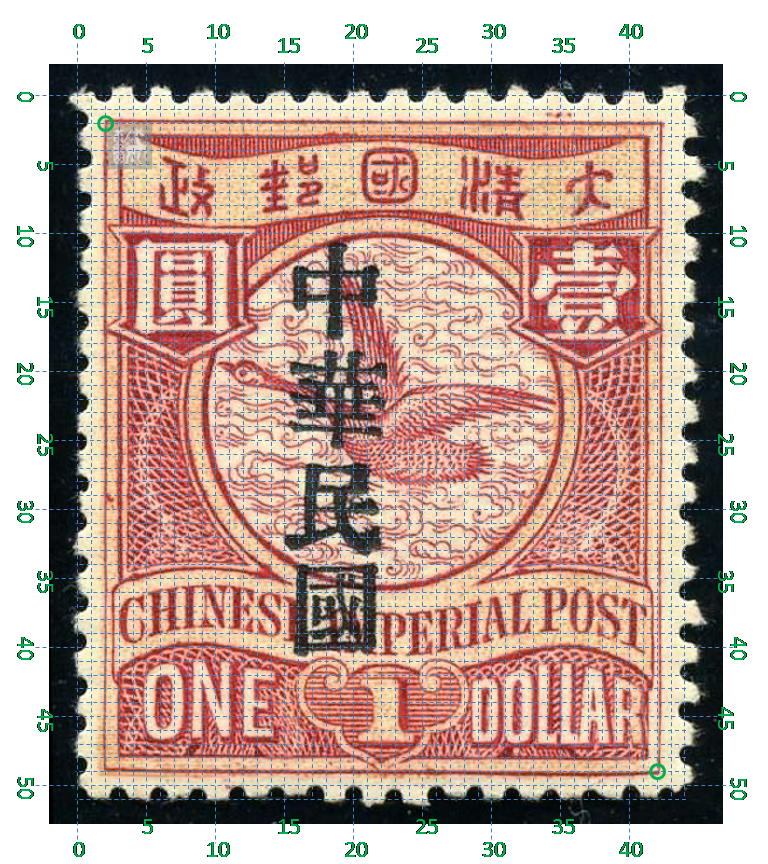

# 大清飞雁壹圆邮票印刷缺陷 (#24)

## 模型
 

## 缺陷列表
1. (17.0mm, 0.88mm) :  大字左上方外边框线外侧有紧邻的三个点横向排列，其中中间一个较大，两边的较小。
1. (4.63mm, 5.5mm) :  国字上横内右部有小点。
1. (1.13mm, 14.5mm) :  左花纹左侧外边框线内侧有正向斜点。
1. (17.0mm, 17.13mm) :  国铭POST中字母P上方，字带与花纹边界线之间有小点。
1. (18.88mm, 20.0mm) :  国铭POST中字母S左下方有小点。
1. (9.25mm, 24.25mm) :  如意左下方，内外边框线间有小点。
1. (18.75mm, 24.75mm) :  面值字母A下方，外边框线外侧有小点。

## 实例
         

## 描述
[REPLACE_DESCRIPTION]
