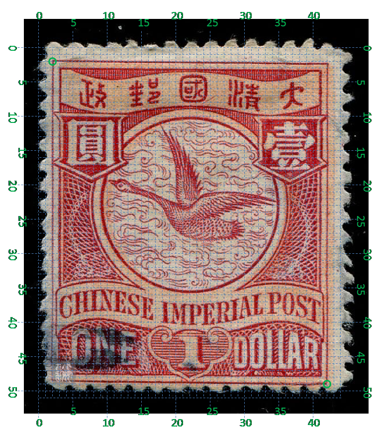

# 大清飞雁壹圆邮票印刷缺陷 (#26)

## 模型
 

## 缺陷列表
1. (11.75mm, 4.25mm) - (12.75mm, 3.5mm) :  国字右下角有一条反向斜线。
1. (15.0mm, 0.88mm) :  清字上方外边框线外有小点。
1. (20.75mm, 1.88mm) :  汉字国铭右上角右侧有小点。
1. (14.5mm, 6.5mm) :  圆环内边界线上内侧，右上方处有小点。
1. (21.75mm, 8.0mm) :  壹字右边外边框线外侧小点（距边框较远，易被齿孔打掉）。
1. (21.0mm, 12.25mm) :  右花纹右侧外边框线上外侧有小点。
1. (21.63mm, 16.5mm) :  右花纹右侧外边框线外有小点（距边框较远，易被齿孔打掉）。
1. (7.88mm, 17.88mm) :  国铭CHINESE最后一个字母E上方有小点。
1. (6.38mm, 23.0mm) :  面值字母E内下方中部有小点。
1. (20.25mm, 23.25mm) :  面值字母R内右下方有小点。

## 实例
        

## 描述
[REPLACE_DESCRIPTION]
