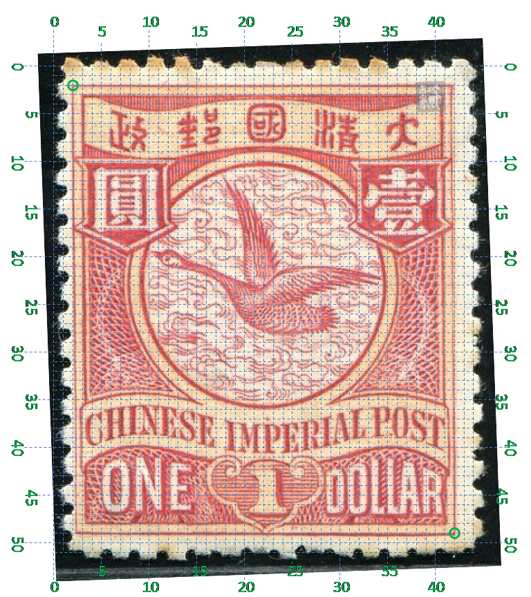

# 大清飞雁壹圆邮票印刷缺陷 (#28)

## 模型
 

## 缺陷列表
1. (6.0mm, 0.88mm) :  邮与政字之间上方，外边框线上有反向长点。
1. (5.5mm, 3.25mm) - (6.25mm, 3.75mm) :  邮与政字之间有淡淡的正向斜线，
1. (9.63mm, 3.0mm) :  国字左侧有非常不明显的小点。
1. (9.38mm, 3.5mm) :  国字左侧有非常不明显的小点。
1. (9.88mm, 3.5mm) :  国字左侧有非常不明显的小点。此点靠近国字，在很多实例中只出现前两个小点。
1. (12.75mm, 3.0mm) :  国字左侧有非常不明显的小点。
1. (16.0mm, 4.0mm) :  清字“月”部右边有小点。
1. (2.63mm, 8.5mm) :  圆字内左下角处有小点。
1. (14.0mm, 7.0mm) - (14.25mm, 7.5mm) :  圆环内右上方有正向斜线。
1. (21.5mm, 5.75mm) :  壹字右边外边框外有小点。
1. (18.5mm, 6.9mm) :  壹字“冖”部内中有小点。
1. (5.75mm, 14.38mm) :  圆环内左下方靠近内边界线处有大片的较淡模糊。
1. (7.13mm, 14.38mm) :  圆环内左下方有大片的较浓模糊，在上述模糊区域右侧。
1. (11.13mm, 18.5mm) :  国铭IMPERIAL字母P上方有点。
1. (17.63mm, 19.5mm) :  国铭POST字母P与O之间下方有小点。
1. (14.5mm, 22.25mm) :  面值字母D内左侧有小点。
1. (15.0mm, 23.25mm) :  面值字母D内右下角有小点。
1. (18.88mm, 22.5mm) :  面值字母A内右侧有小点。
1. (19.5mm, 22.5mm) :  面值字母R内左侧有小点。
1. (3.0mm, 24.63mm) :  面值O字母下，外边框线外有小点。
1. (12.88mm, 24.13mm) :  如意右下方，内外边框线之间有两个横向紧邻的小点。

## 实例

## 描述
[REPLACE_DESCRIPTION]
