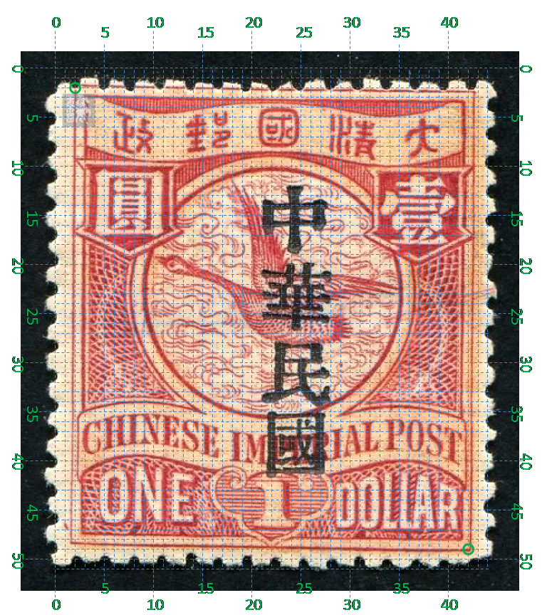

# 大清飞雁壹圆邮票印刷缺陷 (#35)

## 模型
 

## 缺陷列表
1. (13.38mm, 2.13mm) :  清字左上方有小点。
1. (1.25mm, 4.0mm) :  汉字国铭字带左下角外左侧有小点。
1. (4.5mm, 11.25mm) :  圆环左侧内边界线上有横向点。
1. (4.13mm, 12.0mm) :  圆环左侧内外边界线间有两个上下紧邻的正斜向点。
1. (4.38mm, 13.63mm) - (4.5mm, 12.63mm) :  圆环左侧内外边界线间一条接近竖直的直线，连通内外边界线。
1. (17.5mm, 9.38mm) :  壹字背景框左下方有一片模糊区域。
1. (17.5mm, 12.5mm) - (22.0mm, 11.5mm) :  一条略微上凸的直线，自圆环右侧内边界线起，至邮票右边界止。
1. (17.5mm, 13.0mm) - (22.0mm, 12.0mm) :  一条直线，自圆环右侧内边界线起，至邮票右边界止。在上述直线下方。
1. (17.0mm, 17.5mm) :  国铭字母P上方字带边界线上有竖向点。
1. (0.75mm, 23.63mm) :  外边框线左下角外上方有正向斜点。

## 实例

## 描述
[REPLACE_DESCRIPTION]
