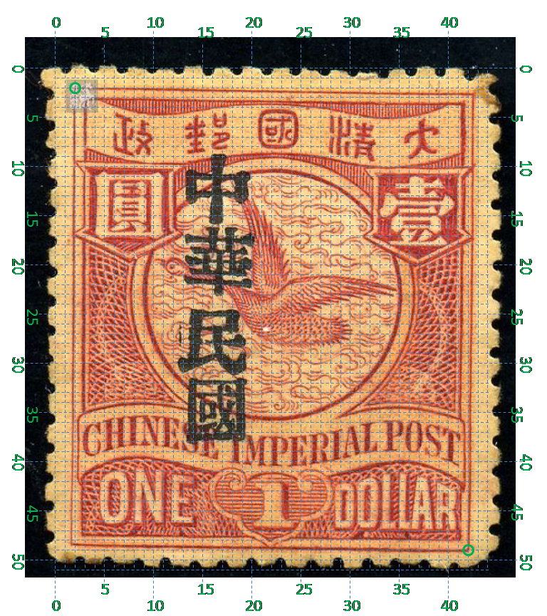
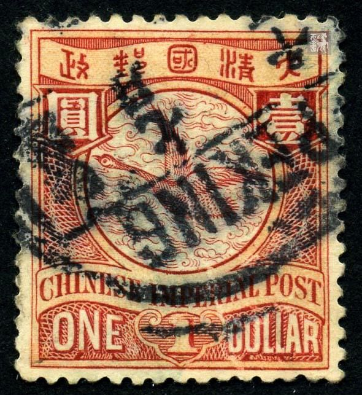

# 大清飞雁壹圆邮票印刷缺陷 (#37)

## 模型
 

## 缺陷列表
1. (1.75mm, 1.0mm) :  上外边框线靠近左上角的位置有淡色的小点。
1. (0.88mm, 1.5mm) :  左外边框线靠近左上角的位置有两条并排的竖向长点，轮廓比较模糊。这个特征可能出现得比较晚，因为在一些实例上很难看出来。
1. (11.88mm, 1.38mm) :  国字右上方内外边框线间有横向的模糊长点。
1. (13.0mm, 2.0mm) :  国字右上方字带边界上内侧有小点。
1. (19.37mm, 1.0mm) :  大字右上方外边框线上外侧有小点。
1. (21.5mm, 1.0mm) :  外边框线右上角右侧有小点。
1. (3.25mm, 7.5mm) :  圆字“贝”部左竖线内有正向斜点。
1. (4.0mm, 6.0mm) - (3.75mm, 6.38mm) :  圆字“口”部内被一反射斜线贯穿。
1. (4.25mm, 6.25mm) :  圆字“口”部内右下方有一正向小斜点。
1. (15.5mm, 6.5mm) :  壹字左侧圆环内外边界线间有反向斜点。
1. (16.0mm, 15.88mm) :  圆环右下方内外边界线间有小点。
1. (3.0mm, 9.13mm) - (3.5mm, 9.63mm) :  圆字背景框下方中间偏左的内外边界线间有一条正向短线。
1. (4.0mm, 9.57mm) - (4.5mm, 9.32mm) :  圆字背景框下方中间偏右的内外边界线间有一条反向短线。

## 实例
                

## 描述
[REPLACE_DESCRIPTION]
