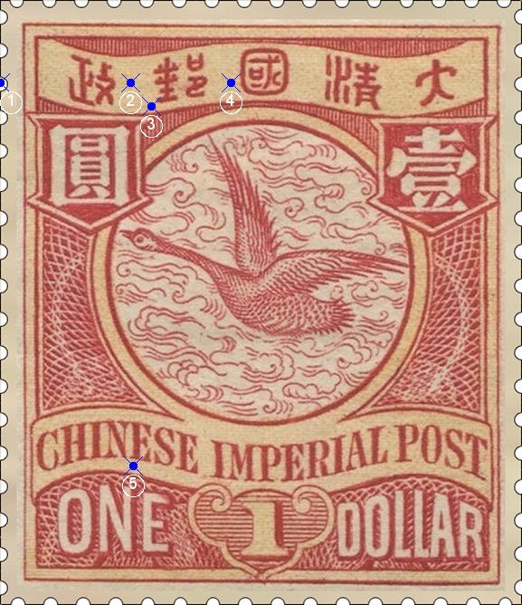

# 大清飞雁壹圆邮票印刷缺陷 (#40)

## 样本与模型
 

## 缺陷列表
1. (0.0mm, 3.5mm) :  汉字国铭字带左边外边框线外有小点，距线比较远，往往被齿孔打掉。
1. (5.5mm, 3.5mm) :  邮与政字中间有淡淡的小点。
1. (6.38mm, 4.5mm) :  邮字左下方有4个相邻的小点，其中最左边两个非常接近，很难区分。
1. (9.75mm, 3.5mm) :  国字左边偏向位置有小点。
1. (5.63mm, 19.63mm) :  国铭CHINESE第5个字母E下方有大圆点。

## 实例
        

## 描述
[REPLACE_DESCRIPTION]
