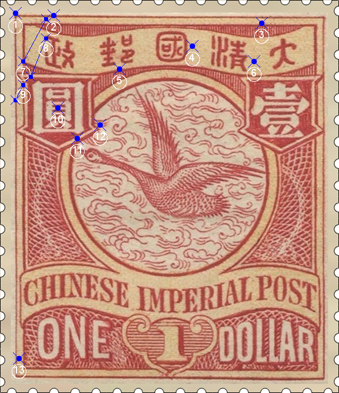
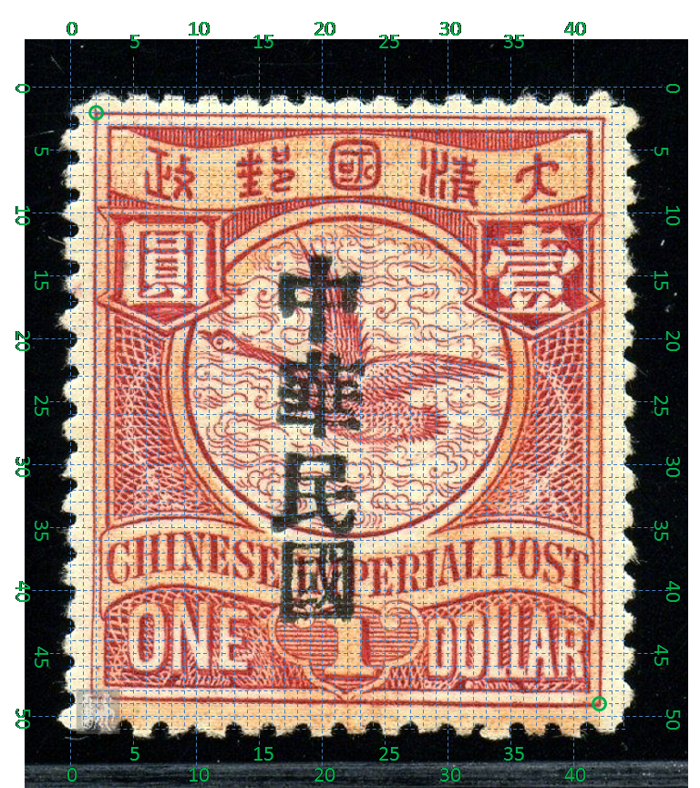

# 大清飞雁壹圆邮票印刷缺陷 (#41)

## 模型
 

## 缺陷列表
1. (1.0mm, 0.88mm) :  外边框线左上角有短竖线，像是左边框线向上延伸出头。
1. (3.5mm, 1.0mm) :  政字正上方内外边框线之间有正向长斜点
1. (17.0mm, 1.5mm) :  大字左上方内边框线外侧有小点。
1. (12.5mm, 3.0mm) :  国字右边有淡淡的小点。
1. (7.75mm, 4.5mm) :  邮字正下方靠近字带边界线处有长点。
1. (16.5mm, 4.0mm) :  清字“月”部右方有淡淡的小点。
1. (1.5mm, 4.0mm) - (3.0mm, 1.25mm) :  政字左边一条反向的细竖线，起自国字带左下角，终于上方外边框线内。
1. (3.0mm, 2.5mm) - (2.0mm, 5.0mm) :  政字左边一条反向的细竖线，起自圆字背景框上方内边界线，终于政字首笔横划左端。
1. (1.5mm, 5.5mm) - (1.0mm, 6.5mm) :  圆字左边内外边框线间有一反向细细的竖线，疑似上述第一条线的一部分，但很难辨认。
1. (3.75mm, 7.0mm) :  圆字“贝”部第二横内有小点。
1. (5.0mm, 9.0mm) :  圆字背景框右下方外边界线内侧有小点。像是圆环内边界线的影响。
1. (6.5mm, 8.13mm) :  圆字背景框右下尖角外的去纹间有一个点。
1. (1.25mm, 23.25mm) :  面值ONE左侧内外边框线之间有一点。

## 实例

## 描述
[REPLACE_DESCRIPTION]
