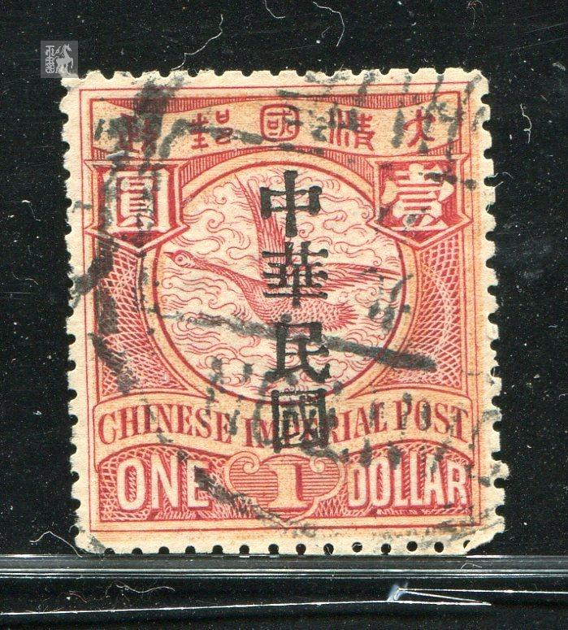

# 大清飞雁壹圆邮票印刷缺陷 (#43)

## 模型
[REPLACE_MODEL]

## 缺陷列表
1. (15.0mm, 0.38mm) :  清字正上方外边框线外有小点。
1. (17.0mm, 0.75mm) :  清字右上方外边框线外有小点。
1. (13.0mm, 19.5mm) :  国铭字母ER之间有小点。
1. (1.5mm, 23.5mm) :  内边框线左下角外侧上方有小点。
1. (14.5mm, 24.5mm) :  面值字母D下方外边框线上有小点。
1. (21.5mm, 21.63mm) :  英文国铭字带右下角右侧，外边框线外有小点。

## 实例

## 描述
[REPLACE_DESCRIPTION]
