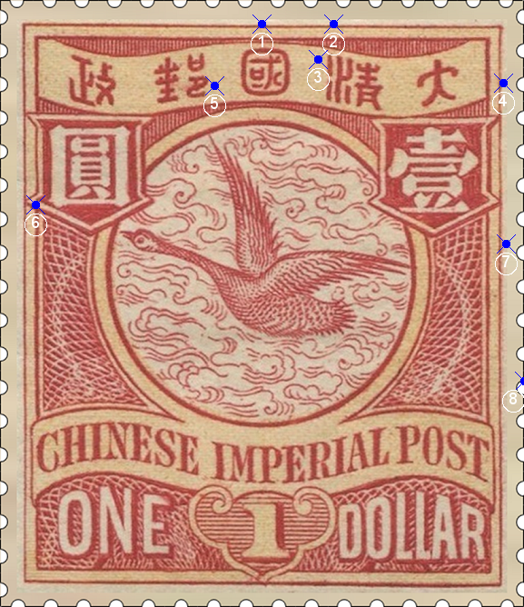

# 大清飞雁壹圆邮票印刷缺陷 (#44)

## 模型
 

## 缺陷列表
1. (11.0mm, 1.0mm) :  国字正上方外边框线外有小点。
1. (14.0mm, 1.0mm) :  清字左上方外边框线上有小点。
1. (13.38mm, 2.5mm) :  清字左上方有小点。
1. (21.13mm, 3.5mm) :  汉字国铭字带右侧外边框线外有小点。
1. (9.0mm, 3.63mm) :  邮字右侧有小点。
1. (1.5mm, 8.63mm) :  圆字左下方的外边界线上内侧有小点，疑似内框线的影响。这个特征在圆字左上方和壹字右上方的线条交界处也略可见。
1. (21.25mm, 10.25mm) :  右花纹右上方外边框线外侧有3个竖向紧邻的小点。
1. (22.0mm, 16.0mm) :  右花纹右方偏下，外边框线外侧有两个小点，左边一个比较明显，右边的很小，距线比较远，容易被齿孔隐藏。

## 实例

## 描述
[REPLACE_DESCRIPTION]
