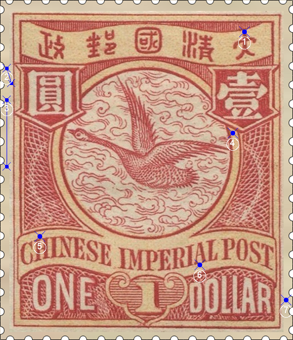

# 大清飞雁壹圆邮票印刷缺陷 (#45)

## 模型
 

## 缺陷列表
1. (18.38mm, 2.38mm) :  大字上方有小点。
1. (0.5mm, 5.12mm) - (0.88mm, 6.25mm) :  圆字左边外边框线外侧有一条正向斜线，略弯。
1. (0.5mm, 7.5mm) - (0.5mm, 12.5mm) :  左花纹左上方外边框线以外，有一条长长的竖线，略有弯曲，黄颜色，是背景色印刷特征。对于这条线的位置变化将另外撰文描述。
1. (17.5mm, 10.0mm) :  圆环右侧偏上的内外边界线之间有小点。
1. (3.0mm, 17.75mm) :  国铭字母H上方有小点。
1. (15.0mm, 19.88mm) :  国铭字母A下方有小点。
1. (21.5mm, 22.5mm) :  面值DOLLAR右侧外边框线外有小点。

## 实例

## 描述
[REPLACE_DESCRIPTION]
