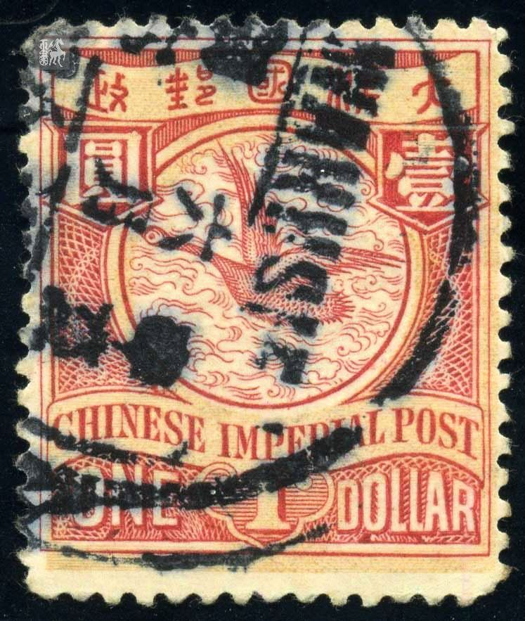

# 大清飞雁壹圆邮票印刷缺陷 (#46)

## 模型
[REPLACE_MODEL]

## 缺陷列表
1. (3.25mm, 3.25mm) :  政字“正”部中竖划左边有小点。
1. (6.63mm, 16.5mm) - (5.63mm, 16.5mm) :  左花纹边界与圆环外边界线之间有一处轮廓不清的墨迹。其中较易分辨的是一个大点和一条横向的粗线，在线下还有一些模糊的油墨。
1. (3.75mm, 19.88mm) :  国铭CHINESE字母I下方字带边界线上有小点。

## 实例

## 描述
[REPLACE_DESCRIPTION]
