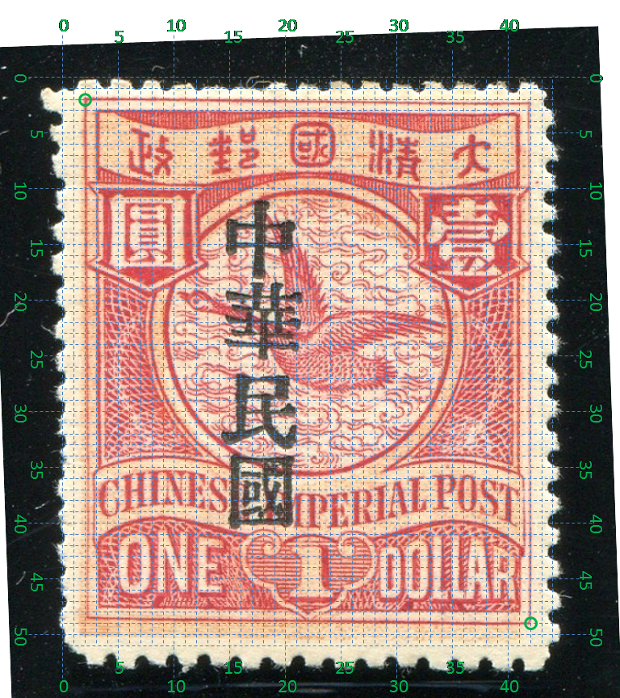
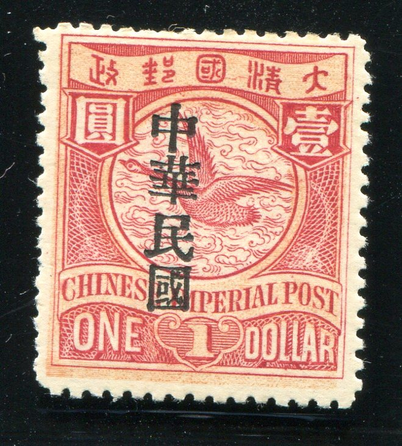

# 大清飞雁壹圆邮票印刷缺陷 (#47)

## 模型
 

## 缺陷列表
1. (5.88mm, 4.63mm) :  邮与政字之间下方字带边界线上有小点。
1. (12.25mm, 3.75mm) - (13.0mm, 3.75mm) :  国字右边有一条横线。
1. (13.13mm, 3.63mm) - (13.75mm, 3.63mm) :  清字左边有一条横线。
1. (9.25mm, 5.0mm) :  鸿雁右翅尖上方圆环内外边界线间有两小点斜向紧邻。
1. (2.5mm, 6.13mm) :  国字左竖内上方有小点。
1. (21.5mm, 4.63mm) :  壹字背景框右上角外有小点。
1. (17.38mm, 17.5mm) :  国铭POST字母P上方有小点。
1. (17.13mm, 23.25mm) :  面值DOLLAR第3个字母L内右下方有小点。
1. (17.0mm, 24.07mm) :  面值DOLLAR第3个字母L下方内框线上有小点。

## 实例
    

## 描述
[REPLACE_DESCRIPTION]
