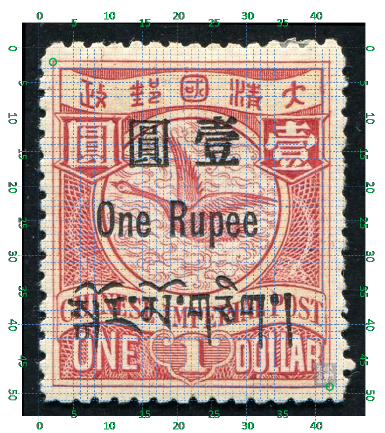
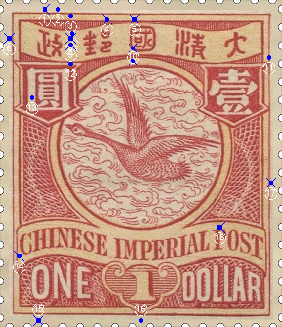
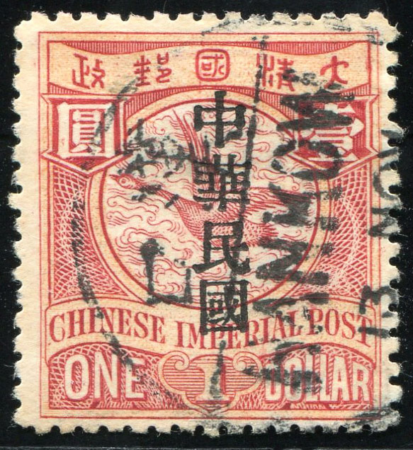

# 大清飞雁壹圆邮票印刷缺陷 (#48)

## 样本与模型
 

## 缺陷列表
1. (3.5mm, 0.75mm) :  政字“正”部正上方外边框线外有淡淡的小点。
1. (4.5mm, 0.75mm) :  政字“攵”部正上方外边框线外有淡淡的小点。
1. (5.5mm, 1.25mm) :  政字右上方内外边框线间有小点。
1. (8.38mm, 1.5mm) :  邮字“阝”部正上方内边框线上有小点。
1. (10.5mm, 1.5mm) :  国字上方有竖向长点贯穿内边框线和字带边界。
1. (0.75mm, 3.0mm) :  汉字国铭字带左侧外边框线外有小点。
1. (5.63mm, 2.63mm) :  政字右上方靠近字带边界线处有小点。
1. (5.5mm, 3.0mm) :  政字右方偏上位置有小点。
1. (5.5mm, 3.5mm) :  政字右方中间位置有小点。
1. (10.38mm, 3.75mm) - (10.38mm, 4.75mm) :  一条竖线起自国字左下角，终于圆环内外边界之间。
1. (21.0mm, 4.5mm) :  壹字背景框右上角上方有小点。
1. (5.5mm, 5.0mm) :  圆字背景框右上方内外边界线间有反向点。
1. (2.5mm, 7.63mm) :  圆字左竖线内有上下相邻两点，上点比较小点更明显一点。
1. (1.5mm, 20.0mm) :  国铭字母C左下角有小点。
1. (3.0mm, 25.0mm) :  面值ONE字母O下方外边框线外有小点。
1. (11.0mm, 25.0mm) :  如意正下方有小点。
1. (21.13mm, 14.25mm) :  右花纹右侧外边框线外有上下紧邻的两个小点。
1. (17.13mm, 17.75mm) :  国铭POST字母P上方有正向长斜点。

## 实例
              

## 描述
[REPLACE_DESCRIPTION]
